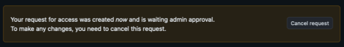

# Generating a Personal Access Token

Launch-CLI makes use of a Personal Access Token (PAT) to authenticate with GitHub.

We currently support fine-grained personal access tokens. More information about setting up a fine-grained token can be [found here](https://docs.github.com/en/authentication/keeping-your-account-and-data-secure/managinwg-your-personal-access-tokens#creating-a-fine-grained-personal-access-token).

To configure a token to work with Launch-CLI, follow these steps:

1. In GitHub, navigate to your personal [Developer Settings](https://github.com/settings/apps) page

2. From the left navigation menu, select **Personal access tokens**, and then select the **Fine-grained tokens** submenu

3. At the top right, press the **Generate new token** button

4. Enter a memorable **Token name**, like `Launch-CLI Token`

5. Choose an **Expiration**, we highly recommend setting yourself a reminder so that you can generate a new token prior to this token's expiration

6. For **Resource owner**, you must choose the organization, not your personal account; select `launchbynttdata` from the dropdown

7. For **Repository access**, choose `All repositories`

8. Expand **Repository permissions** and make the following selections:

- **Administration**: Read and write (used for setting default permissions on newly-created repositories)
- **Contents**: Read and write (used to push and pull from repositories)
- **Metadata**: Read-only (mandatory; required by other permissions)
- **Pull requests**: Read and Write (coming soon!)

9. Expand **Organization permissions** and make the following selections:

- **Members**: Read-only (used to retrieve organization group information)

10. Click **Generate token**

## Launch token approvals

Creation of a token against the organization will require approval of your token, and you will receive a notification that your request for access has been submitted:

Please also post a message in the [#devsecops-platform](https://launchbynttdata.slack.com/archives/C05T54M99HB) channel in Slack and someone will review and approve your token as soon as possible.

Once approved, you will be shown the token value once and never again. Ensure that you copy the token value into a secure location (like a password manager) for safekeeping.
